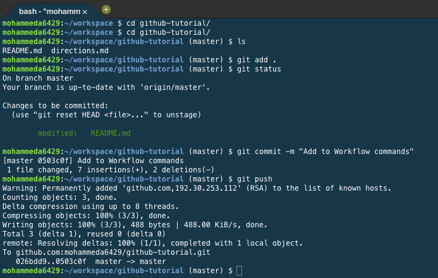

# GitHub Tutorial

_by Mohammed Amin_

---
## Git vs. GitHub
Git is the place where you can actually write your code, and it doesnt need Github to run.  Github is what stores your code in the cloud, and it needs Git in order to run.

---
## Initial Setup
##### How to make a Github account
1. Go to [Github.com](https://github.com/login)  
2. Click 'create an account'
3. Create a _username_, put in your _email_, and create a _password_
4. Click on _Create an account_
5. Choose a plan that you want to start off with and then click _Continue_
6. Finally, you fill out the little questionnaire they give you (Optional), and then click _Submit_
7. ##### How to connect your _Github_ account to _C9_
1. Go to [Github.com](https://github.com/login)
2. After logging into Github click the icon on the top right, and then click settings 
3. Look to the left sidebar and click _SSH and GPG keys_  

4. Click _New SSH Key_, then title it Cloud 9
5. Go to _Cloud 9_ and on the top right there should be a gear icon, click it
6. Copy the second _SSH Key_ and paste it into the key section in Github
7. Then click _Add SSH Key_
8. Go back to Cloud 9 and open _github-learning IDE_
9. Finally type in `ssh -T git@github.com`, and it should reply with _"Hi <your username>! You've successfully authenticated, but GitHub does not provide shell access._"

---
## Repository Setup
1. Open Cloud 9 and go into your workspace

2. Make sure you're in your workspace, once you're go ahead and type `mkdir (first repo name)`

3. Go into your first repo by using `cd (first repo name)`, when you go into your folder, first thing you should do is `git init`, that command initializes git inside the folder

4. To create a file inside the folder type `touch (filename)`

5. Open up the file by typing `c9 (Filename)` and then type something in the file

6. After you wrote something inside the file you can now do `git add .`
7.Then type `git commit -m ""`, Inside the quotation marks write what you did inside the folder in the present tense.

8. Before you can push you have to go to _[Github.com](www.Github.com)_

9. After logging in on the top right you should see a plus icon, click on it and click on _new respitory_

10. Name it the same thing as you named your first respitory in Cloud 9

11. After that, you should see a screen that says quick setup, (make sure you have SSH clicked on)

12. You should see two commands on the bottom of the page they look similar to this `"git remote add origin git@github.com:username/reponame.git"` and `"git push -u origin master"`.

13. Copy the commands one at a time. Copy the first command `git remote add origin git@github.com:username/reponame.git` and paste it in your repo that you have created. This command creates a bridge between your c9.io repo and remote repo on github.com. Then copy and paste the second command `"git push -u origin master"`. 

14.Now when you type `git push` it'll send the code up to [Github](www.github.com)

15. Now just type git push to push the changes you have made to your remote repo you just created.

---
## Workflow & Commands
`git status` checks the status of the files in the repo if they have been added or not

`git add .`, adds the files to the staging area and makes them ready for commit

`git commit -m ""` commits the changes you have made and finalizes the changes you have made it.     
`-m "(Message goes here)"` Inside the quotaion marks you write a message for yourself or others in the present tense, saying what you did to your code since the your last `commit`
`git push` pushes the changes you have made to your remote repo.  

---
## Rolling Back Changes
To undo git add use git reset.

To erase a commit entirely and go back to the pervious commit use `git reset -- hard HEAD ~1`.

To not get rid of your files and index use "git reset -- soft HEAD~1" You can also use 'git revert' to go back to a pervious commit

To undo a push use `git reset -- hard HEAD ~1` which goes back to the pervious commit and then force push by using `'git push -f'`.

## Collaboration
